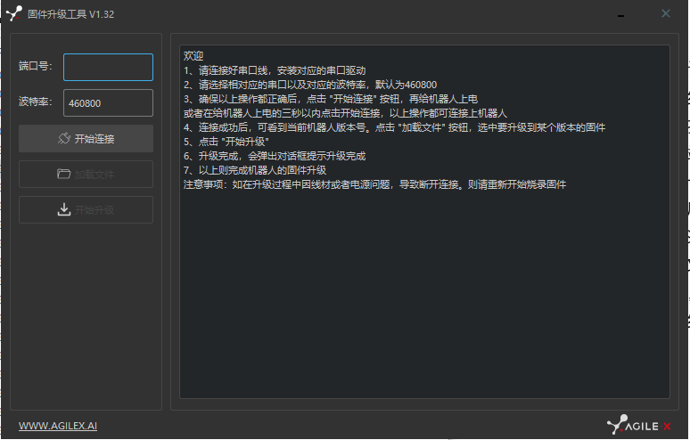

# Firmware Upgrade

Prepare:

* A Computer running Windows OS
* RS232-2-USB Cable

Upgrade Process:

* Download and unzip the upgrade utility (in Windows)
* Power down the robot and connect the RS232-2-USB cable to the robot and the computer
* Open the upgrade utlity and choose the right COM port 

* Power on the robot and click "开始连接" within 6 seconds. If successful, you will see "连接成功" message in the text box on the right. If not, turn off the robot and try again.
* Click "加载文件" and choose the firmware binary in "/firmware" folder for your platform.
  - Scout 2.0: scout-v1.4-12-0-g070a72.bin
* Click "开始升级" and wait util the upgrade finishes.
* (DO NOT power off the robot when the upgrade is in progress)
* Restart the robot. 
